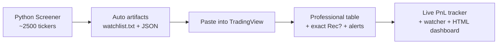

# 🚀 HYDRA Screener Local

**Momentum + Regime-Aware Equity Selection • 100% Local • Hybrid Python + TradingView**

A powerful, fully local daily screener that runs the complete HYDRA logic across ~2500 US stocks and hands off clean, exact data to a beautiful TradingView dashboard.

[](https://www.python.org/)
[](LICENSE)
[]()

---

## ✨ Why HYDRA?

- **Full SPEC-aligned scoring**: Risk-adjusted momentum, strict filter (+18% bonus), rich 5-subscore regime, 4 dynamic pillars, 4 special modes, sector concentration control.
- **One-command daily ritual**: `python daily.py` → perfect watchlist + rich JSON ready for TradingView.
- **True hybrid experience**: Python does the heavy 2500-ticker lift. Paste two files into the Pine script and get exact Python composites, strict flags, ranks, and recommended status in a professional table.
- **Live PnL & observability**: Dynamic Excel tracker + live watcher + self-contained HTML dashboard.
- **Zero cloud, zero cost**: Everything runs locally on your machine.

---

## ⚡ Quick Start (Recommended)

```bash
# 1. Clone & install
git clone https://github.com/lucasabu1988/HydraOmniCapital.git
cd HydraOmniCapital/hydra_screener_local
pip install -r requirements.txt

# 2. One-command daily run (the new standard)
python daily.py

# 3. (Optional) Update live PnL in your cycle tracker
python daily.py --refresh-pnl
```

Or with the new packaged entrypoints (after `pip install -e .`):

```bash
hydra-daily
hydra-refresh
hydra-watch
hydra-dashboard
hydra-console
```

**Next step in TradingView** (takes 30 seconds):
1. Copy the comma-separated list from `pine/watchlist.txt`
2. Paste it into the **"Watchlist Symbols"** input of the `HYDRA_Screener [Hybrid v1.2]` indicator
3. Paste the **entire content** of `pine/hydra_last_summary.json` into the **"Optional: paste FULL content..."** input

→ You now have an exact replica of the Python-recommended list with perfect `Rec?` flags, composites, and special modes.

---

## 🏗️ The Hybrid Flow (Python does the work, TV makes it beautiful)



**Full details**: See [HYBRID_USAGE.md](HYBRID_USAGE.md)

---

## 🛠️ Core Tools (2026 Edition)

| Tool                        | Command                        | What it does |
|----------------------------|--------------------------------|--------------|
| **Daily Ritual**           | `python daily.py`             | Full run + beautiful TV instructions |
| **Live PnL Refresher**     | `python refresh_current_prices.py --lookback 5` | Updates current prices so Excel PnL formulas stay live |
| **Live Watcher**           | `python live_watcher.py --interval 60 --refresh-pnl` | Polls for new runs and auto-triggers webhooks + PnL |
| **HTML Dashboard**         | `python generate_html_dashboard.py` | Self-contained browser dashboard (no TV needed) |
| **Console Dashboard**      | `python console_dashboard.py --watch` | Terminal execution dashboard (regime, Rec? list, cycles PnL) |
| **Cycle PnL Tracker**      | `log_cycle_positions.py`      | Logs every recommended list (including exact hybrid ones) to dynamic Excel |
| **Analysis & Backtest**    | `python analyze_history.py --export-excel --hybrid-only` | Deep history + win-rate + Excel reports (hybrid-only mode available) |
| **Artifact Cleaner**       | `python clean_artifacts.py --dry-run` | Safe cleanup of output/, backtest/ temps, data_cache/, __pycache__, etc. |

---

## 📊 Results & Validation

Backtested 5-position, 5-day rotation (2000–2026) using the exact current logic:

- **CAGR**: 15.62%
- **Max Drawdown**: -21.7% (very controlled vs SPY)
- **Sharpe**: 1.08
- **Total Return**: ~4341%

The strict filter alone delivered **+4.54% the next day with 100% win-rate** in historical analysis.

All core logic is validated against [HYDRA_ALGORITHM_SPEC.md](HYDRA_ALGORITHM_SPEC.md) v1.2.

---

## 🎯 Philosophy

- Everything **100% local** (Windows-first, works great in modern terminals)
- No servers, no API keys, no data leaks
- Designed for **5-day trading cycles**
- Full multi-universe support (`UNIVERSE="all"` recommended for maximum breadth)

---

## 📚 Documentation

- [HYBRID_USAGE.md](HYBRID_USAGE.md) — Complete hybrid workflow + TradingView setup
- [HYDRA_ALGORITHM_SPEC.md](HYDRA_ALGORITHM_SPEC.md) — Single source of truth (formal pseudocode + formulas)
- [experiments/README.md](experiments/README.md) — All research/backtest scripts
- `run_all_tests.py` — One-command contract + integration test suite

---

## 🤖 Unattended (TASK-364)

`python daily.py --v9 --unattended` runs the ritual without prompts and exits **0** ok, **1** the
legacy screener failed but v9 ran, **2** preflight or an unknown state schema refused to plan (no
sheet written), **3** exception. Every run sends a one-screen summary; 2/3 send an `ALERT`.

Transports: `state/alerts.log` is always written; set `HYDRA_NOTIFY=discord,telegram` to add
network transports, with `DISCORD_WEBHOOK_URL`, `TELEGRAM_BOT_TOKEN`, `TELEGRAM_CHAT_ID` in the
environment. Secrets are never printed or logged.

Windows Task Scheduler: copy `schedule/hydra.env.example` to `schedule/hydra.env` (gitignored),
fill it in, then run `schedule\install_task.cmd` once. It registers "HYDRA daily" Mon-Fri at
**16:45 local time** — this machine runs UTC-5 without DST, so that is 17:45 ET in summer and
16:45 ET in winter, always after the 16:00 ET close. `schedule\uninstall_task.cmd` removes it.
Logs land in `logs/daily_<yyyymmdd>.log`. The scheduled run never places orders.

## 🧹 Maintenance & Hygiene

```bash
# Run all contract + integration tests
python run_all_tests.py

# Clean generated files
python clean_artifacts.py --dry-run
python clean_artifacts.py --force
```

---

## 🔮 What's Next?

The system is production-ready for daily use. Future directions include:
- Even richer live dashboard (web + notifications)
- Improved cross-asset breadth signals
- Packaging improvements & easier distribution

Contributions and feedback welcome!

---

**Made for traders who want serious edge without giving up control or privacy.** 

Run it. Paste it. Trade it. Track it. All locally.

