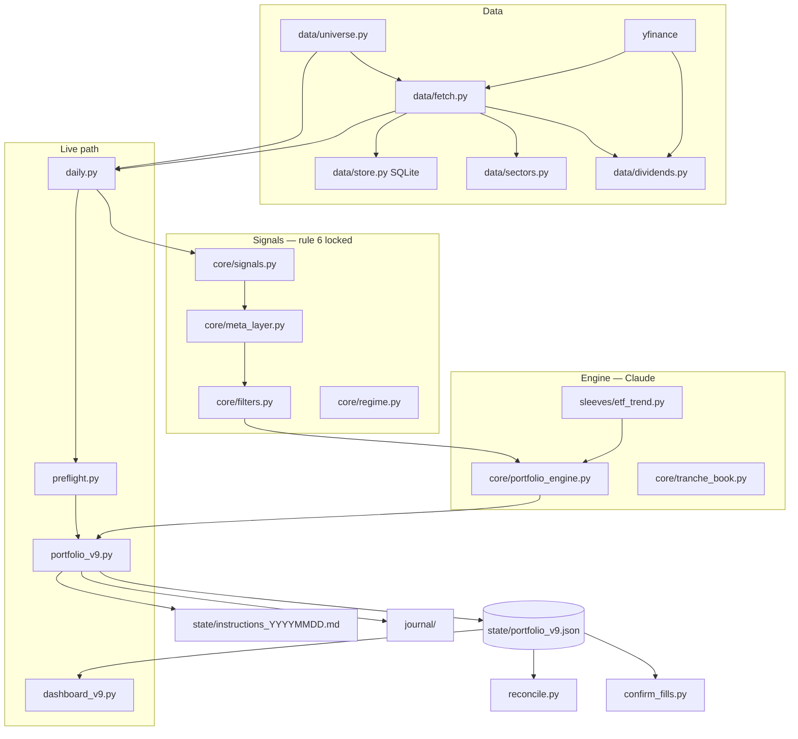

# HYDRA architecture

Production since 2026-09-07 is **HYDRA v9**: a 50/50 book of a T20 stock sleeve and an
ETF trend sleeve, four tranches each, one pair renewed every 5 NYSE bars, orders executed
by hand at the next session's close (MOC t+1). There is no broker API and no cloud.

This note is the map of the local screener in `hydra_screener_local/`. The old COMPASS
engine and the Render dashboard are legacy and must not be revived
(`archive/root-legacy-2026-09/`).

## Data flow



A production day (`daily.py --v9`):

1. Screener: universe → fetch prices/volume → sectors → `generate_daily_candidates`.
2. `preflight.evaluate` over the fetched frames. HARD fail stops the plan unless `--force`.
3. `portfolio_v9.run`: load state → settle pending (if any) → credit dividends → accrue
   interest (inside `plan`) → `plan` → write state + instruction sheet → journal.
4. Lucas executes the sheet at the **next NYSE session** close. The following `daily.py`
   settles at that close.

## Modules

| Area | Path | Role |
|---|---|---|
| Scoring | `core/signals.py`, `core/meta_layer.py`, `core/regime.py`, `core/filters.py` | Momentum, regime, selection. **Locked** (GROKBOARD rule 6). |
| Engine | `core/portfolio_engine.py`, `core/tranche_book.py` | `new_state` / `plan` / `settle` / `mark`. Pure, no network. Claude owns it. |
| ETF sleeve | `sleeves/etf_trend.py` | 12m excess vs T-bill, inverse-vol. Adapter class `EtfTrend` (TASK-366) is unused by `plan` yet. |
| Stock adapter | `sleeves/stocks_t20.py`, `sleeves/registry.py` | Seam only. Engine still hardcodes two sleeves. |
| Data | `data/fetch.py`, `data/universe.py`, `data/sectors.py`, `data/dividends.py` | yfinance + caches. `fetch_prices_and_volume_cached` + SQLite store exist behind `USE_BAR_STORE = False`. |
| Live CLI | `portfolio_v9.py`, `daily.py`, `preflight.py` | The production path. Frozen until the first settle is verified. |
| Ops | `confirm_fills.py`, `reconcile.py`, `journal.py`, `evidence_review.py`, `warm_sectors.py`, `store_cli.py` | Manual fills, broker vs state, spec 10.1/10.2, sector cache, bar store. |
| Dashboard | `dashboard_v9.py`, `dashboard/index.html` | Read-only HTTP on **127.0.0.1:8765**. Only write: `state/equity_curve.csv`. |
| Calendar | `utils/trading_calendar.py` | NYSE sessions (`next_nyse_session`, `last_nyse_session_on_or_before`). |

## State schema (`state/portfolio_v9.json`, gitignored)

```
schema_version: 1
algo_version: "v9"
anchor_date, last_run_date, last_renewal_date, week_index
capital_reference
sleeves: {stocks|etf: {tranches: [{k, opened, units, cash, last_px, stale}]}}
pending, ledger, write_offs, transfers, interest, dividends
```

`mix` is in `config.V9` today, not in the state (design: TASK-366). Backups: `state/backup/`
on disk, plus `HYDRA_BACKUP_DIR/state_v9/<date>/` when the env is set. `journal/` is
gitignored and copied with the state.

## What writes vs what is read-only

| Writes | Read-only |
|---|---|
| `portfolio_v9.py` → `state/portfolio_v9.json`, `instructions_*.md/.json`, `state/backup/` | `dashboard_v9.py` (except append-only `equity_curve.csv`) |
| `daily.py` → journal + whatever the v9 CLI writes | `reconcile.py` (exit 0, writes nothing) |
| `confirm_fills.py` → state cash/units/ledger | `evidence_review.py` → `.comms/evidence-*.md` only |
| `data/store.py` → `data_cache/bars.sqlite` (not on the live path) | `preflight.py` |

## Secrets and env

No API keys. Env names only:

- `HYDRA_BACKUP_DIR` — off-disk copy of `state/` + `journal/`. Unset → same disk, preflight WARN.
- `UNIVERSE` — overrides `config.UNIVERSE` (`all` in production).
- `HYDRA_NOTIFY` — reserved for TASK-364 (not wired).

Never log env **values**.

## Config that is not scoring

`USE_BAR_STORE = False` (TASK-361). Production still calls `fetch_prices_and_volume`.
Claude flips the flag after a same-day cached vs direct compare.

## Legacy — do not revive

- COMPASS live engine, Render dashboard, `state/compass_state_*`.
- Pine / TradingView is **parked**. `pine/` and the hybrid feeder stay in the tree;
  do not spend time compiling the indicator.
- Root `tests/` of the old product: archived.
